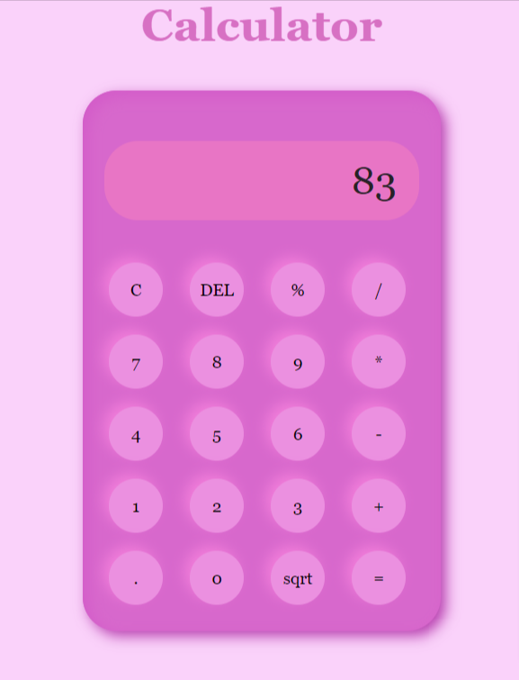

# Calculator Project

This is a simple calculator project built using HTML, CSS, and JavaScript.
## Live Version

Check out the live version of the calculator [here](https://mounikakuncha14.github.io/calculator/).

## Description

The calculator project provides a basic user interface for performing arithmetic calculations. It features a responsive design and colorful styling.

## Features

- Addition, subtraction, multiplication, and division operations
- Percentage calculation
- Square root function
- Responsive design with vibrant colors

## Preview

## Usage

1. Enter numbers and operations using the buttons.
2. Press "=" to calculate the result.
3. Press "C" to clear the input.
4. Press "DEL" to delete the last character.
5. Press "sqrt" to calculate the square root of the number.
6. Enjoy experimenting with different calculations!

## Installation

No installation is required. Simply visit the [live version](https://mounikakuncha14.github.io/calculator/) in your web browser.

## Credits

- Developed by [Kuncha Mounika]

Feel free to explore the live version and have fun with calculations!
